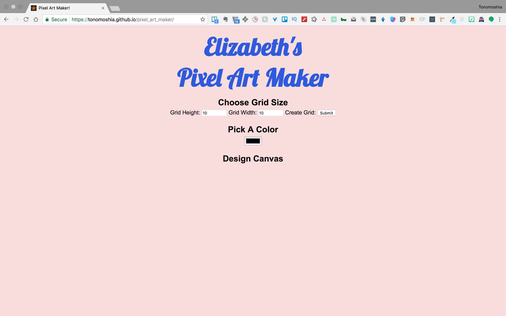

# Pixel Art Maker Project

Pick any color to draw on the screen in a pixel art style.

**Instructions:**

1.  Choose the number of rows and collumns.
2.  Pick the color from the ColorPicker color palette.
3.  Draw using the mouse by clicking and moving.
4.  Press reset button to clear the grid.
5.  Start over.

